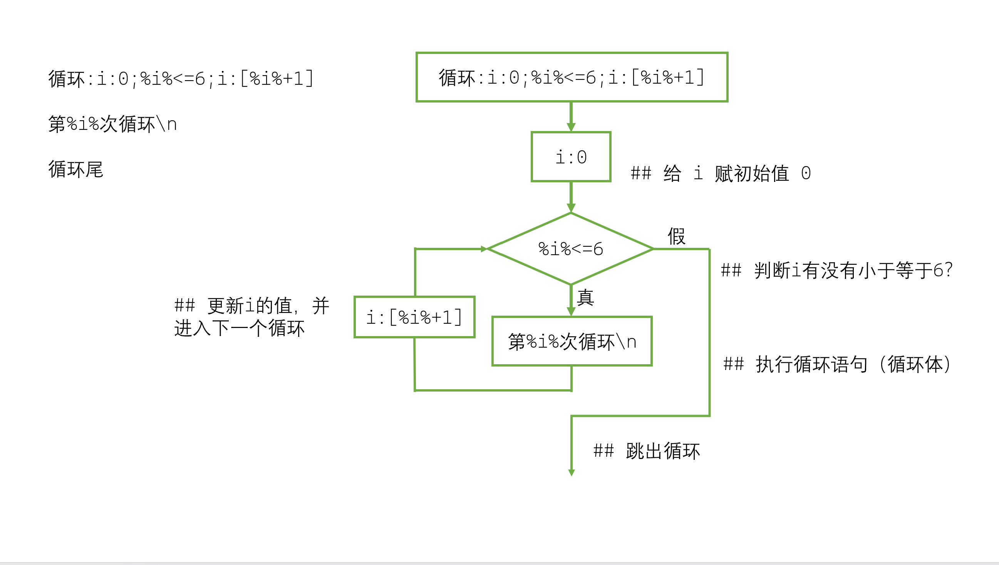

# 逻辑结构

## 条件表达式
可以判断真假的表达式。

比较符号：`==` `!=` `>` `<` `>=` `<=`\
逻辑连接符号：`&` `|`，从左往右计算。\
**支持括号指定优先级。**

比较时，`==`和`!=`默认采用字符串比较，其他的则采用数字比较。\
可以直接使用`t`和`f`表示“真”和“假”。

例如：
```nyaplus
a:1
b:2
%a%==%b%   --> 真(t)
%a%!=1   --> 假(f)
%a%>%b%   --> 假(f)
%a%<=%b%   --> 真(t)
t|f&t|f   --> 真(t)
t|f&(t&f)   --> 假(f)
```

> [!WARNING]
> 条件表达式不可以单独使用，必须和`如果`或`循环`语句一同使用。

## 返回语句
如下返回语句可以强制结束该代码块的执行并输出结果，\
可以和`如果`搭配实现类似if-else的结构
```nyaplus
返回
```

## 分支结构
语法格式为：
```nyaplus
如果:条件表达式
语句...
如果尾
```
当条件表达式为真时，会执行中间的语句内容，\
否则，跳过中间所有语句

支持分支结构嵌套使用。
> [!NOTE]
> 建议在书写时将结构写完整，不要出现不对应的`如果`结构\
> 如果只有如果语句而没有如果尾，那么默认如果尾在代码块末尾（或者返回语句提前跳出）


## 循环
语法格式为：
```nyaplus
循环:初始化语句;条件表达式;更新语句
语句...    ## 这部分语句被称为“循环体”，即循环执行的代码
循环尾
```
> [!NOTE]
> 声明：上述的“初始化语句”和“更新语句”可以填入任意语句，\
> 这么命名是依照这两个位置的常见用途来命名的

当进入循环后，会先执行**初始化语句**，常见在此处新建一个变量，称为“循环变量”\
接下来判断**条件表达式**是否成立，如果成立，则执行循环体\
执行完循环体所有语句后，会先执行**更新语句**，然后再检查**条件表达式**是否成立。\
当某一次循环中检查**条件表达式**不成立后，将会结束循环，去执行`循环尾`后面的内容
> [!NOTE]
> 请在书写时将结构写完整，否则实现不了预期的循环功能

下面用一个小例子和流程图进行解释。
```nyaplus
循环测试
循环:i:0;%i%<=6;i:[%i%+1]
第%i%次循环\n
循环尾
```

输出为：
```
第0次循环
第1次循环
第2次循环
第3次循环
第4次循环
第5次循环
第6次循环
```


